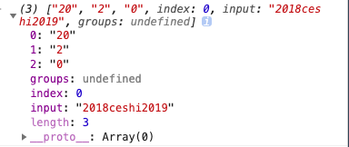
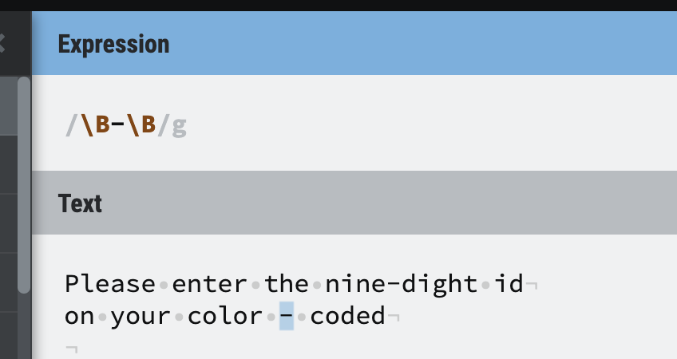
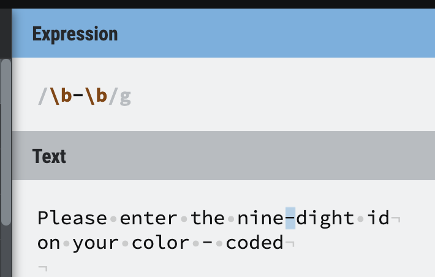
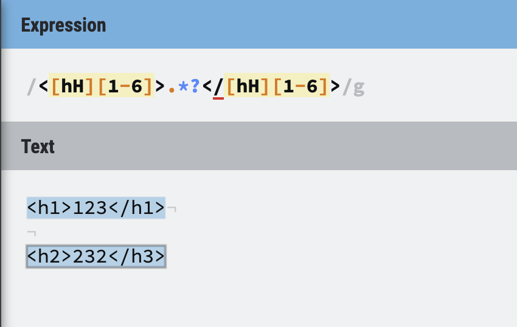
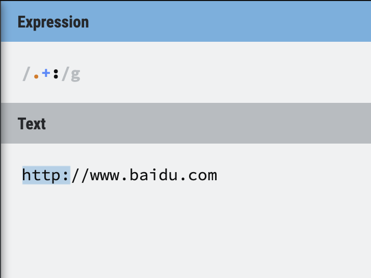
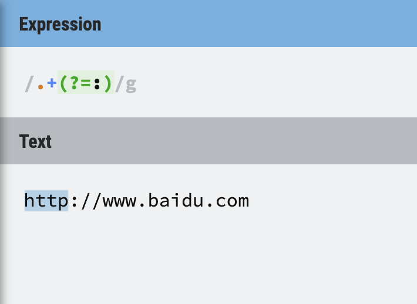

# 正则匹配的四个常用方法

## 1. test()

验证字符串是否和正则相匹配

用法：`regexp.test(string)`

结果：若匹配返回`true`，若不匹配返回`false`

```js
var a = '123abc';
/\w+/.test(a); // true
/\s+/.test(a); // false
```

## 2. exec() 

将字符串中匹配的内容捕获出来，**只会捕获一次**

用法：`regexp.exec(string)`

返回值：是一个数组，若无分组则数组里的内容包含三项，分别是匹配的内容、匹配内容的起始索引、原字符串

`exec()`处理分组

 ###### 返回值：

- 第一项是匹配的内容
- 第二项开始是分组（括号里匹配）的内容，有几个分组就有几项
- 倒数第二项是匹配内容的起始索引
- 倒数第一项是原字符串

注意：若不需要捕获分布的内容，则在不需要捕获分组的里面加上原字符 ?:（匹配不捕获）

```js
var str = "2018ceshi2019";
 
var reg = /\d\w/;
console.log(reg.exec(str));//["20", index: 0, input: "2018ceshi2019"]
 
var reg = /(\d)(\w)/;
console.log(reg.exec(str));//["20", "2", "0", index: 0, input: "2018ceshi2019"]
 
var reg = /(?:\d)(?:\w)/;
console.log(reg.exec(str));//["20", index: 0, input: "2018ceshi2019"]
 
```



## 3. match()

将字符串中匹配的内容捕获出来

若加上量词g则一次性捕获所有匹配的内容放到数组里返回，若不加则与exec()的返回值一样

用法：`string.match(regexp)`

```js
var str="1 plus 2 equal 3"
console.log(str.match(/\d+/g)) // ["1", "2", "3"]
```


## 4. replace()

将字符串中匹配的内容捕获出来

用法：`string.replace(值类型 | regexp, 值类型 | 回调函数)`

该方法不改变原有字符串

```js
var str = "11a22b33c44d";
var newStr = str.replace(/\d+/g, function ($0,$1,$2) {
    // 第一个形参$0 表示匹配的字符
    // 第二个形参$1 表示匹配字符的起始索引
    // 第三个形参$2 表示原字符串
    return $0*2;
});
console.log(str);//11a22b33c44d
console.log(newStr);//22a44b66c88d
 
// 若有量词，则分组里面的内容是匹配字符的最后一个字符
var newStr2 = str.replace(/(\d+)/g, function ($0,$1,$2) {
    // 第一个形参$0 表示匹配的字符
    // 若有分组，则从第二个参数开始就是分组的内容
    // 倒数第二个形参 表示匹配字符的起始索引
    // 倒数第一个形参 表示原字符串
    return $0*2;
})
console.log(str);//11a22b33c44d
console.log(newStr2);//22a44b66c88d
```

经典例题

```js
// 大写数字替换小写数字
var str = "38576";
var a = ["零","壹","贰","叁","肆","伍","陆","柒","捌","玖"];
str = str.replace(/\d/g, function () {
    return a[arguments[0]];
});
console.log(str);//叁捌伍柒陆
// 排除法
// 获取地址栏中的参数并放入对象中
var str = "http://www.baidu.com?id=557131028857&name=ceshi&age=8";
var reg = /([^?=&]+)=([^?=&]+)/g;
var obj = {};
str.replace(reg, function ($0, $1, $2) {
    obj[$1] = $2;
});
console.log(obj);//{id: "557131028857", name: "ceshi", age: "8"}
//去掉html标签
var str="<div id='div1' class='aa'>皇帝被废，太后痛哭流涕，</div><p>皇室威严扫地，群臣无不悲愤。</p>";
var reg = /<[^<>]+>/g;
str = str.replace(reg,"");
```

# 正则语法篇

## 1. 元字符

- 匹配文本元字符
- 匹配语法要求元字符

<!-- | 元字符 | 说明 |
| -------- | ------ |
| .	 | 匹配除了换行符外任意字符 |
| \s | 匹配任意的空白符 |
| \d | 匹配数字	|
| \w | 匹配字母、数字、下划线、汉字	|
| \b | 匹配单词边界	|
| ^  | 匹配字符串的开始	|
| $  | 匹配字符串的结束	|
| [] | 定义一个字符集合	| -->

| 空白元字符 | 说明                                  |
| ---------- | ------------------------------------- |
| [\b]       | 回退（并删除）一个字符（Backspace键） |
| \f         | 换页符                                |
| \n         | 换行符                                |
| \r         | 回车符                                |
| \t         | 制表符                                |
| \v         | 垂直制表符                            |

| 数字元字符 | 说明                            |
| ---------- | ------------------------------- |
| \d         | 任何一个数字字符 等价于[0-9]    |
| \D         | 任何一个非数字字符 等价于[^0-9] |

| 字母数字元字符 | 说明                                                         |
| -------------- | ------------------------------------------------------------ |
| \w             | 任何一个字母数字字符（大小写均可）或者下划线字符 等价于[a-zA-Z0-9_] |
| \W             | 任何一个非字母数字字符（大小写均可）或者下划线字符 等价于[^a-zA-Z0-9_] |

| 空白字符元字符 | 说明                                   |
| -------------- | -------------------------------------- |
| \s             | 任何一个空白字符 等价于[\f\n\r\t\v]    |
| \S             | 任何一个非空白字符 等价于[^\f\n\r\t\v] |

注意：`\b`是一个特例，不属于空白字符元字符

POSIX字符类-略

`[]` 
具体做法:

- 把所有字符列举出来
- 利用元字符`-`以字符区间方式给出

注意：字符集合可以用^取非，这将把给定的字符集合强行排除在匹配操作以外

## 2. 重复匹配

## 3. 贪婪与懒惰

贪婪型会尽可能从开头一直匹配到文本的结尾

懒惰型会匹配尽可能少的字符

| 贪婪型元字符 | 懒惰型元字符 |
| ------------ | ------------ |
| *            | *?           |
| +            | +?           |
| {n, }        | {n, }?       |

## 4. 匹配边界

##### 1. 单词边界 \b

查找一个单词 `cat` 
`\bcat\b`

| 单词边界元字符 | 说明                           |
| -------------- | ------------------------------ |
| \b             | 匹配前后都是单词边界的连字符   |
| \B             | 匹配前后都不是单词边界的连字符 |





##### 2. 字符串边界

| 字符串边界元字符 | 说明           |
| ---------------- | -------------- |
| ^                | 定义字符串开头 |
| $                | 定义字符串结尾 |

注意：js不支持`分行匹配(?m)`，多么好的东西居然不支持

## 5. 子表达式

`()`
匹配ip地址
`((\d{1,2}|1\d{2}|2[0-4]\d|25[0-5])\.){3}((1\d{2}|2[0-4]\d|25[0-5]|\d{1,2}))`

## 6. 回溯引用


如何解决让匹配模式的后半部分知道前半部分匹配到的值，这时需要使用回溯引用。

- 回溯引用替换

```js
var str = '123-mm';
var strReg = str.replace(/(\d+)-([A-Za-z]+)/g,'$2');
console.log(strReg)//mm  上面那段$2这个就是表示正则第二组个匹配到的内容
```

| 大小写转换 | 说明                             |
| ---------- | -------------------------------- |
| \E         | 结束\L或\U                       |
| \l         | 把下一个字符转换为小写           |
| \L         | 把\L或\E之间的字符全部转换为小写 |
| \u         | 把下一个字符转换为大写           |
| \U         | 把\U或\E之间的字符全部转换为大写 |

## 7. 前后查找

注释：JavaScript不支持向后查找



让结果不包含`:`


练习课：https://www.cnblogs.com/dreamingbaobei/p/9717234.html