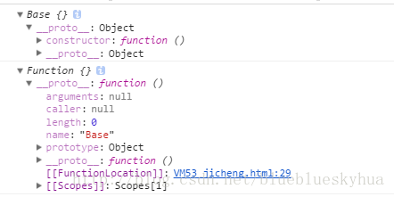
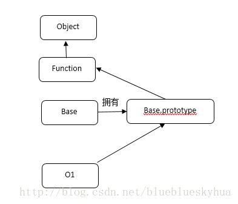

# New

## new 做了哪些事情

```js
//创建Person构造函数，参数为name,age
function Person(name, age) {
	this.name = name;
	this.age = age;
}
//实例化对象小明
xm = new Person('xiaoming', 18);
//打印实例化出来的对象小明
console.log(xm);
```

用 new 关键字实例化对象时，首先创建了一个空对象 xm，并且这个空对象包含两个属性 name 和 age，分别对应构造函数中的两个属性，实例化出来的这个对象 xm 是继承自 Person.prototype,那么现在我们就可以总结出 new 关键字在实例化对象时内部都干了什么

1. 创建一个空对象，并使该空对象继承 Func.prototype；

2. 执行构造函数，并将 this 指向刚刚创建的新对象；

3. 返回新对象；

```js
function Person(name, age) {
	this.name = name;
	this.age = age;
}

function _new() {
	//1.拿到传入的参数中的第一个参数，即构造函数名Func
	var Func = [].shift.call(arguments);
	//2.创建一个空对象obj,并让其继承Func.prototype
	var obj = Object.create(Func.prototype);
	//3.执行构造函数，并将this指向创建的空对象obj
	Func.apply(obj, arguments);
	//4.返回创建的对象obj
	return obj;
}

xm = _new(Person, 'xiaoming', 18);

console.log(xm);
```

## Object.create 和 new 区别

创建对象的方式，我以我碰到的两种创建方式，Object.create 和 new 来说明

```js
var Base = function() {};
var o1 = new Base();
var o2 = Object.create(Base);
```

以下是 Object.create 的实现方式。可以看出来，Object.create 是内部定义一个对象，并且让 F.prototype 对象 赋值为引进的对象/函数 o，并 return 出一个新的对象。

```js
Object.create = function(o) {
	var F = function() {};
	F.prototype = o;
	return new F();
};
```

`var o1 = new Base()`的时候 new 做了什么，new 做法是新建一个 obj 对象 o1，并且让 o1 的**proto**指向了 Base.prototype 对象。并且使用 call 进行强转作用环境，从而实现了实例的创建。

```js
var o1 = new Object();
o1.[[Prototype]] = Base.prototype;
Base.call(o1);
```

来看看两个对象打印情况，看似是一样的。



我们对原来的代码进行改进一下。

```js
var Base = function() {
	this.a = 2;
};
var o1 = new Base();
var o2 = Object.create(Base);
console.log(o1.a);
console.log(o2.a);
```


可以看到 Object.create 失去了原来对象的属性的访问。
那再看看 prototype 呢？（一开始没理解 prototype 和**proto** 的关系。造成对这两种方式的创建理解非常费解）。
再一次对代码进行改进。

```js
var Base = function() {
	this.a = 2;
};
Base.prototype.a = 3;
var o1 = new Base();
var o2 = Object.create(Base);
console.log(o1.a);
console.log(o2.a);
```

我一开始以为输出的值是 2,3。。。以为 prototype 还是存在的。。结果发现真的发错特错。我们看运行的结果。


依旧是如此。

那我们就以图说话。

1. new 方式创建对象



2.Object.create 方式创建对象


（F 在创建后被销毁）

看完上图，我们就知道了，为什么通过 Object.create 构造的连 Base 原型上的属性都访问不到，因为他压根就没有指向他的 prototype。这也就说明了**proto** 和 prototype 的区别。所以上面在 prototype 定义的 a，只是 Base 的 prototype 对象上的一个属性。

再来看看就是：

new 关键字必须是以 function 定义的。
Object.create 则 function 和 object 都可以进行构建。

| 比较     | new                       | Object.create           |
| -------- | ------------------------- | ----------------------- |
| 构造函数 | 保留原构造函数属性        | 丢失原构造函数属性      |
| 原型链   | 原构造函数 prototype 属性 | 原构造函数/（对象）本身 |
| 作用对象 | function                  | function 和 object      |

#### instanceof 和 isPrototypeOf

写了创建一个对象实例，并且说了通过原型链来完成这一个个对象之间的联系，但是你怎么知道就一定含有呢？所以我们需要一个判断机制。

```js
function Foo() {
	//...
}
Foo.prototype.ff = 2;
var a = new Foo();
a instanceof Foo; //true
```

instanceof 说的是在 a 的整条[[Prototype]] 是否含有 Foo.prototype 对象。 但是这个方法只能实现对象(a)和函数(带.prototype 引用的 Foo),如果你想判断两个对象（a 和 b）是否通过[[Prototype]]链关联。只用 instanceof 就无法实现。

所以这里用到了 isPrototypeOf。

```js
var a = {};
var b = Object.ceate(a);
```

b.isPrototypeOf(a);//在 a 的[[Prototype]]是否出现过 b 来判断。

来看看 isPrototypeOf 实现方式。

```js
function isRelatedTo(o1, o2) {
	function F() {}
	F.prototype = o2;
	return o1 instanceof F;
}
```

上述函数通过了构建一个辅助函数 F，构建了一个 prototype 对象。从而达到 instanceof 比较的条件。
console.log(a.isPrototypeOf(b) === isRelatedTo(b,a));// true

constructor
举例来说，.constructor 是在函数声明时候的默认属性。
我们先来看看下面的代码。

```js
function Foo() {}
console.log(Foo.prototype.constructor === Foo); //true
var a = new Foo();
console.log(a.constructor === Foo); //true
```

看起来 a.constructor === Foo 为真，意味着 a 的确有一个.constructor 指向 Foo 的.constructor 属性。
但是可能出于不理解，或者很多的误操作，都会导致我们.constructor 指向的丢失。如下：

```js
function Foo() {}
Foo.prototype = {};
var a1 = new Foo();
console.log(a1.constructor === Foo); //false
console.log(a1.constructor === Object); //true
```

可以看到 a1 并没有.constructor 属性。那是为什么呢。？因为 a1 没有.constructor 属性，他会委托[[prototype]]链上的 Foo.prototype。但是新建的 Foo.prototype 也没有.constructor,所以继续往上找，一直到了顶端的 Object.prototype。
再来，为了绝对的保证我的代码可靠，不被一些错误操作，影响我们的执行。

```js
function Foo() {}
Foo.prototype = {};
var a1 = new Foo();
Object.defineProperty(Foo.prototype, 'constructor', {
	enumerable: false,
	writeable: true,
	configureable: true,
	value: Foo, // 让.constructor指向Foo
});
```

想要说明的就是一点对于.constructor，我们并不能完全信任，稍不留神，一个手误或者不懂原理就去改对象。会发生惨烈的指向错误，所以认为 constructor 的意思是“由…构造”，这个误解代价太高了。

所以可以看出.constructor 是一个非常不可靠，并且不安全的引用。在开发中尽量避免使用这些引用。如果用了，请记得检查你的原型，避免出现.constructor 丢失。

# demo
[demo1](https://github.com/Programmer-girl/study_test/blob/master/demo/New/1-1.html)
[demo2](https://github.com/Programmer-girl/study_test/blob/master/demo/New/1-2.html)