参考文章：
https://www.cnblogs.com/ertingbo/p/6610042.html

https://juejin.im/entry/5b6ee4cbe51d451988565f80
# 页面图片预加载与懒加载策略

在图片的加载策略之前，我们先来了解下html网页中，图片的不同位置的图片分别是在什么时候发起图片资源请求的

### img 标签

img标签会在html渲染解析到的时候，如果解析到img src值，则浏览器会立即开启一个线程去请求该资源。 正常情况是解析到了src便发起请求，

1. img 标签隐藏 通过css样式隐藏img的显示

```html
  
```

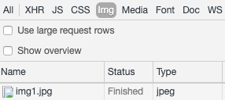

发现除了Opera不请求，其他浏览器都会马上请求，

```html
 
```

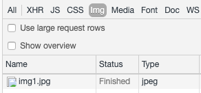

全部浏览器都会请求 

2. img 同一张图重复

```html
  
 
```

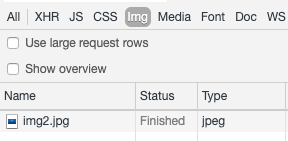

所有的浏览器都只请求一次，因为http在发出请求的时候，会检验是否有缓存，有缓存就会从缓存读取。

那么你知道如何判断资源是否是缓存还是服务器返回的呢，看这边

### img 在background中

1. 重复背景

```html
<style type="text/css">   
    .test1 { background: url(img1.jpg) }   
    .test2 { background: url(img1.jpg) }   
</style>   
<div class="test1">test1</div>   
<div class="test2">test2</div>
```

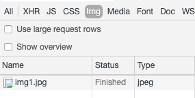

所有浏览器都只发起一次请求

​	2. 隐藏元素背景

```html
<style type="text/css">   
    .test3 { display: none; background: url(img2.jpg) }   
</style>   
<div class="test3">test1</div>
```

Opera 和Firefox对display:none的元素的背景，不会立即发生请求，只有当其display 不为none才会发起图片请求。其他浏览器则是立即发起请求

​	3. 重写背景

```html
<style type="text/css">   
    .test1 { background: url(img1.jpg) }   
    .test1 { background: url(img2.jpg) }   
</style>   
<div class="test1">test1</div>
```

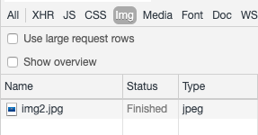

重写背景，浏览器只会请求覆盖的那个背景图

4. 多重背景

```html
<style type="text/css">   
    .test1 { background-image:url("img1.jpg"),url("img2.jpg"); }   
</style>   
<div class="test1">test1</div>
```

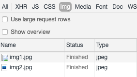

对全部的背景都会请求

​	5. 元素不存在，但是设置了背景

```html
<style type="text/css">   
    .test3 { background: url(img1.jpg) }   
    .test4 { background: url(img2.jpg) }   
</style>   
<div class="test3">test1</div>
```

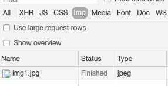

.test4并不存在，这个时候，浏览器并不会去请求img3.jpg，当且仅当背景的应用元素存在时（不管在当前是显示还是不显示），才会发生请求

​	6. cover背景

```html
<style type="text/css">   
    a.test1 { background: url(img1.jpg); }   
    a.test1:hover { background: url(img2.jpg); }   
</style>   
<a href="#" class="test1">test1</a>
```

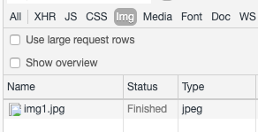

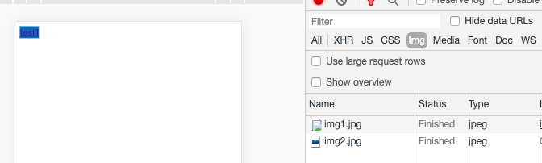


触发hover的时候，才会请求hover下的背景。在实际中，会遇到这个背景图初次显示闪一下的情况，如果要优化，就预加载这张图即可。

​	7. js动态生成img并赋值

```html
<script type="text/javascript">   
    var el = document.createElement('div');   
    el.innerHTML = '';   
    //document.body.appendChild(el);   
</script> 
```

只有Opera 不会马上请求图片，其他浏览器都是执行了代码就发起请求，Opera一定要元素添加到dom时，才会发出请求

在做项目的过程中，经常会遇到需要图片预加载与懒加载，图片预加载就是为了在展示的时候减少图片加载过程不好的载入体验，而图片懒加载则是处于这张图片不在当前可视区域展示，为了网络带宽以及提升首次加载速度而做的优化。

## 图片预加载

- img标签 

如上面所列举的那些情况，就可以利用，比如用img标签与dom的background-image 来达到预加载的效果。在展示前就可以保证图片资源已经加载完成。

- js Image对象

```js
const preloadImg = (url) => {
  const img = new Image();
  if(img.complete) {
    //图片已经加载过了，可以使用图片
    //do something here
  } else {
    img.onload = function() {
      //图片首次加载完成，可以使用图片
      //do something here
    };
  }
  img.src = url;
}
```

注意，最好是先定义onload，再赋值src，不然会出现资源返回，但是onload还没有挂载的情况。
在实际的项目我遇到过的，就是需要在某些图片加载完成再做下一步，那么这个时候，我们就需要知道某些图片序列确定是预加载完成，同样还是使用preloadImg，结合一下promise，有多个图片资源，可以用promise.all。就可以保证所有的图片加载完成再进行下一步

```js
var promiseAll = imgData.map(function (item, index) {
    return new Promise(function (resolve, reject) {
      var img = new Image();
      img.onload = function () {
        img.onload = null;
        resolve(img);
      };
      img.error = function () {
        reject('图片加载失败');
      };
      img.src = item;
    });
  });
  Promise.all(promiseAll).then(
    function () {
      // 图片全部加载完成，进行下一步
      // todo
    },
    function (err) {
      console.log(err);
    }
  );

```

## 图片懒加载

所谓图片懒加载，就是延迟加载图片资源，是对网页性能的一种优化方式，比如当我们打开一个网页的时候，优先展示的图片，比如首屏图片，就先加载，而其他的图片，当需要展示的时候，再去请求图片资源，避免了首次打开时，一次性加载过多图片资源。

### 1.最简单的图片懒加载

同样地，我们再回顾一下文章开始讲的，如果是img标签，浏览器解析到img的src有值，就会去发起请求，那么我们就可以借助这个操作，在懒加载的图片，先不赋值，等到需要展示的时候，再赋值

```js


const src = $('.show-img').attr('data-src');
$('.show-img').attr(src, src);
```

### 在距离可视区域一定距离的时候加载图片

一般实际中，我们不会在需要展示的时候，才发起图片请求，不然就不会有图片预加载的需求了，那么如何判断图片在何时需要展示呢？在下拉流之类的网页中，我们一般是在图片距离可视区域的一定距离，比如50px，就开始请求图片资源

#### 如何判断图片是否在可视区域中？

- 原生js判断元素是否在可视区域内，这里的可视区域的距离都是以垂直距离为准

方法一：
A: document.documentElement.clientHeight 可视窗口的高度
B: element.offsetTop dom相对于文档顶部的距离
C: document.documentElement.scrollTop 滚动条滚动的距离
B - C < A 即说明元素在可视区域内

方法二：getBoundingClientRect

```js
const domObj = element.getBoundingClientRect(); 

domObj.top		//元素上边到视窗上边的距离;
domObj.right	//元素右边到视窗左边的距离;
domObj.bottom	//元素下边到视窗上边的距离;
domObj.left		//元素左边到视窗左边的距离;
const clientHeight = window.innerHeight;
//当 domObj.top < clientHeight 表示dom在可视区域内了
```

#### 实际应用

```js
const preImages = $('img[data-src]').not('.pred-img');
Array.from(preImages).forEach((item) => {
    if (isPreLoad(item)) {
        loadImg(item);
    }
});

const loadImg = (img) => {
    if (!img.src) {
        img.src = img.attr('data-src').addClass('pred-img');
    }
};

const isPreLoad = () {
    const preObj = getBoundingClientRect();
    const cH = $(window).height();
    return preObj <= cH + 100;
};
```

代码中有二处，一处是not('.pred-img'),作为加载过的图片的标记，第二处是识别区域高度加了100，提前100px的地方就开始加载。当然在具体展示的时候，还可以给图片添加加载中的样式，以及识别图片加载异常

```html
 
```

### jquery.lazyload 插件

```html
<div class="article-content">
    
    
    
    
    
    
</div>
<script>
require('./libs/jquery.lazyload');
addImagesLazyload();
function addImagesLazyload() {
  var $images = $('.article-content img:not([data-lazyload])');
  var preCount = 2;
  $images.each(function(i, img) {
    var $img = $(img);
    var $box = $img.parent();
    var src = $img.attr('data-original');

    if (src && !src.match(/\?/)) {
      src += '?imageView2/2/w/750';
    }

    $img.attr('data-lazyload', 1);
    $img.off('error').on('error', function() {
      $box.addClass('img-error');
    });
    $img.off('load').on('load', function() {
      $box.removeClass('img-box img-error');
    });

    if (src) {
      $img.attr('data-original', src);
      if (i < preCount) {
        img.setAttribute('src', src);
      }
    }
  });

  var $lazyed = $images.slice(preCount);
  if ($lazyed.length) {
    $lazyed.lazyload({ // 使用lazyload
      threshold: 200 // 图片距离可视区200px的时候开始请求
    });
  }
}
</script>
```

preCount 是加载页面的时候想要加载的图片，其他的图片就是懒加载。`load` 与`error`中就可以添加图片加载与加载失败默认显示图片 关于lazyload的配置参数如下：
`placeholder : "img/img.jpg"`

占位图片，此图片用来占据将要加载的图片的位置,待图片加载时,占位图则会隐藏

`effect: "fadeIn"`

图片加载效果, 可取值有`show`(直接显示),`fadeIn`(淡入),`slideDown`(下拉)
`threshold: 200`
滚动条在离目标位置还有200的高度时就开始加载图片,可以做到不让用户察觉
`event: 'click'`
点击事件触发时才加载值有`click`(点击),`mouseover`(鼠标划过),`sporty`(运动的),`foobar`(…).可以实现鼠标莫过或点击图片才开始加载
`ailurelimit : 10` `failurelimit`,值为数字.`lazyload`默认在找到第一张不在可见区域里的图片时则不再继续加载,但当HTML容器混乱的时候可能出现可见区域内图片并没加载出来的情况,`failurelimit`意在加载N张可见区域外的图片,以避免出现这个问题。


知乎图片懒加载

未加载

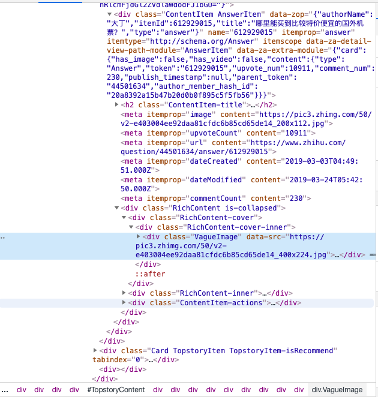

已加载

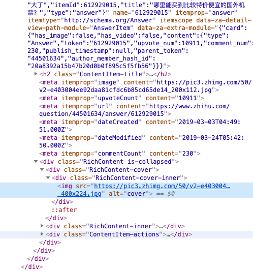


