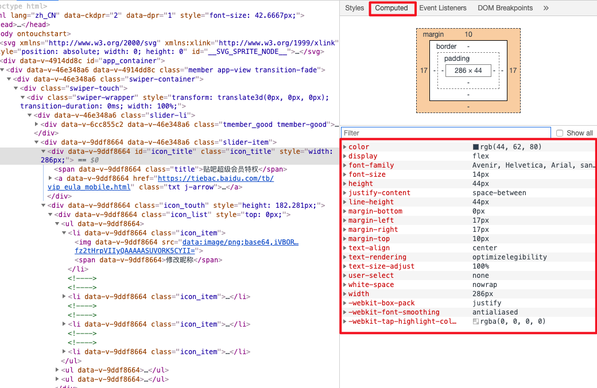

# pixel

###### Web content->  ...  ->pixel

### Web content

- Html

- Css
- js
- img等

### lifecycle

![image-20191204103310863](../img/image-20191204103310863.png

## 第一步：html解析器

html 解析器接收标签、文本组成的流。**html标签给文档赋予了语义上的层级结构，渲染的第一步就是去解析这些标签，生成能反映该结构的对象类型，即文档对象模型，简称DOM**。dom基于html结构，dom树节点就是dom节点。

dom的作用：

- 作为页面的内部表示
- 将查询或修改渲染的api暴露给js

所以V8js引擎用了一个绑定系统，将真实的DOM树做一层简单的包装后暴露给DOM的web api，dom树就建立完成了。

## 第二步：css样式引擎

css是有选择器和属性的，css选择器的选择范围是其属性声明所作用与的DOM节点的子集。

样式引擎的任务是对这些进行整理，当遇到一个css规则表时，样式引擎会将css文本解析成样式规则的对象模型，具有丰富的选择器和属性值映射的表述能力。

我们要弄清楚的地方是样式到底是怎样作用与dom元素的？也就是样式分析和样式重算。 **在这个阶段，我们从文档的有效样式表中，获取所有已解析的样式规则，包括浏览器提供的一组默认样式，然后计算出每个dom元素样式属性的最终值，储存在ComputedStyle（计算样式）对象模型中，他就是一个样式属性和值映射的超大的map，ComputedStyle对象会挂载元素，算出它是红的、斜体之类，这就是样式引擎的输出。**如下图，已经将计算样式暴露给开发者。

## 第三步：layout

我们已经构建好了DOM，也计算完了所有的样式，下一步是确定所有元素的视觉几何结构。

对块级元素，我们要计算出一个矩形的坐标，这个矩形与元素内容所占据的集合区域相对应，最简单的例子中，布局只是按照dom中的顺序，一个接一个垂直地放置区块，区块随页面流动出现，所以称之为区块流，注意即使是这种简单情况，也有相当大的复杂性，因为每个区块的位置是由前一区块的高度决定，想要获取区块的高度，就必须找到文本的换行标记，通过计算样式中的字体，来测量运行时文本渲染尺寸，这些都是布局的一部分。   

**流程管道中各个阶段都将上一阶段的输出作为输入，并产出影响后续阶段的输出。**

所有的布局信息都保存在另一个与DOM关联的树结构中，我们称之为布局树。

树中的节点，实现了布局算法，所有这有很多的布局类LayoutBox、LayoutInline、LayoutTable等，使用哪个取决于元素需要用到什么布局算法。他们全部都继承自LayoutObject这个公共基类。  所以布局树中每个节点都是一个LayoutObject对象。

dom节点与布局对象基本上是一一对应的，但是有一些例外，如果给一个节点设置了`display:none`，它并不会创建布局对象，有时候还会存在没有节点的布局对象。 

### paint

我们已经得到了布局对象的几何位置信息，可以开始绘制了。绘制像是在指定的坐标内画一个红色的矩形这样的动作。**注意现在只是在记录操作，目前还没有真正的执行。**若想让元素在重叠时正确堆叠，就必须按正确的顺序绘制元素，绘制是按照层叠顺序进行的，与dom顺序略有不同，受控于样式属性中的`z-index`。

### raster

栅格化

### gpu

渲染是在沙箱中进行的。

每秒60帧是一个黄金准则，如果花费超过 1/60秒的时间来渲染一帧就会卡顿

https://www.bilibili.com/video/av35265997?from=search&seid=10087915040650604264