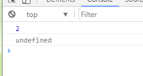
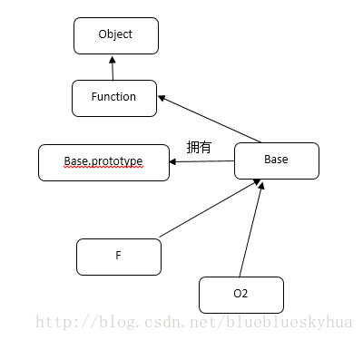

# New

## new做了哪些事情
```
//创建Person构造函数，参数为name,age
function Person(name,age){
    this.name = name;
    this.age = age;
}
//实例化对象小明
xm = new Person('xiaoming',18);
//打印实例化出来的对象小明
console.log(xm);
```

用new关键字实例化对象时，首先创建了一个空对象xm，并且这个空对象包含两个属性name和age，分别对应构造函数中的两个属性，实例化出来的这个对象xm是继承自Person.prototype,那么现在我们就可以总结出new关键字在实例化对象时内部都干了什么

1. 创建一个空对象，并使该空对象继承Func.prototype；

2. 执行构造函数，并将this指向刚刚创建的新对象；

3. 返回新对象；

```
function Person(name,age){
    this.name = name;
    this.age = age;
}
 
function _new(){
    //1.拿到传入的参数中的第一个参数，即构造函数名Func
    var Func = [].shift.call(arguments);
    //2.创建一个空对象obj,并让其继承Func.prototype
    var obj = Object.create(Func.prototype);
    //3.执行构造函数，并将this指向创建的空对象obj
    Func.apply(obj,arguments)
    //4.返回创建的对象obj
    return obj
}
 
xm = _new(Person,'xiaoming',18);
 
console.log(xm);
```

## Object.create 和new区别
创建对象的方式，我以我碰到的两种创建方式，Object.create 和new来说明

```
var Base = function () {}
var o1 = new Base();
var o2 = Object.create(Base);
```
以下是Object.create的实现方式。可以看出来，Object.create是内部定义一个对象，并且让F.prototype对象 赋值为引进的对象/函数 o，并return出一个新的对象。

```
Object.create =  function (o) {
    var F = function () {};
    F.prototype = o;
    return new F();
};
```
`var o1 = new Base()`的时候new做了什么，new做法是新建一个obj对象o1，并且让o1的__proto__指向了Base.prototype对象。并且使用call 进行强转作用环境，从而实现了实例的创建。
```
var o1 = new Object();
o1.[[Prototype]] = Base.prototype;
Base.call(o1);
```
来看看两个对象打印情况，看似是一样的。


我们对原来的代码进行改进一下。
```
var Base = function () {
    this.a = 2
}
var o1 = new Base();
var o2 = Object.create(Base);
console.log(o1.a);
console.log(o2.a);
```



可以看到Object.create 失去了原来对象的属性的访问。 
那再看看prototype呢？（一开始没理解prototype和__proto__ 的关系。造成对这两种方式的创建理解非常费解）。 
再一次对代码进行改进。
```
var Base = function () {
    this.a = 2
}
Base.prototype.a = 3;
var o1 = new Base();
var o2 = Object.create(Base);
console.log(o1.a);
console.log(o2.a);
```
我一开始以为输出的值是2,3。。。以为prototype还是存在的。。结果发现真的发错特错。我们看运行的结果。


依旧是如此。

那我们就以图说话。
1. new方式创建对象


2.Object.create方式创建对象



（F在创建后被销毁）

看完上图，我们就知道了，为什么通过Object.create构造的连Base原型上的属性都访问不到，因为他压根就没有指向他的prototype。这也就说明了__proto__ 和 prototype 的区别。所以上面在prototype定义的a，只是Base的prototype对象上的一个属性。

再来看看就是：

new关键字必须是以function定义的。
Object.create 则 function和object都可以进行构建。

|比较|new|Object.create|
|---|---|---|
|构造函数|保留原构造函数属性|丢失原构造函数属性|
|原型链|原构造函数prototype属性|原构造函数/（对象）本身|
|作用对象|function|function和object|

#### instanceof 和 isPrototypeOf
写了创建一个对象实例，并且说了通过原型链来完成这一个个对象之间的联系，但是你怎么知道就一定含有呢？所以我们需要一个判断机制。

这里写图片描述
```
function Foo(){
    //...
}
Foo.prototype.ff = 2;
var a  = new Foo();
a instanceof Foo; //true
```
instanceof 说的是在a的整条[[Prototype]] 是否含有Foo.prototype对象。 但是这个方法只能实现对象(a)和函数(带.prototype引用的Foo),如果你想判断两个对象（a 和 b）是否通过[[Prototype]]链关联。只用instanceof就无法实现。

所以这里用到了isPrototypeOf。
```
var a = {};
var b = Object.ceate(a);
```
b.isPrototypeOf(a);//在a的[[Prototype]]是否出现过b来判断。

来看看isPrototypeOf实现方式。
```
function isRelatedTo(o1,o2){
    function F(){}
    F.prototype = o2;
    return o1 instanceof F;
}
```
上述函数通过了构建一个辅助函数F，构建了一个prototype对象。从而达到instanceof比较的条件。 
console.log(a.isPrototypeOf(b) === isRelatedTo(b,a));// true

constructor
举例来说，.constructor是在函数声明时候的默认属性。 
我们先来看看下面的代码。
```
function Foo(){
}
console.log(Foo.prototype.constructor === Foo);//true
var a = new Foo();
console.log(a.constructor === Foo);//true
```
看起来a.constructor === Foo 为真，意味着a的确有一个.constructor指向Foo的.constructor属性。 
但是可能出于不理解，或者很多的误操作，都会导致我们.constructor指向的丢失。如下：
```
function Foo(){
}
Foo.prototype = {}
var a1 = new Foo();
console.log(a1.constructor === Foo);//false
console.log(a1.constructor === Object);//true
```
可以看到a1并没有.constructor属性。那是为什么呢。？因为a1没有.constructor属性，他会委托[[prototype]]链上的Foo.prototype。但是新建的Foo.prototype也没有.constructor,所以继续往上找，一直到了顶端的Object.prototype。 
再来，为了绝对的保证我的代码可靠，不被一些错误操作，影响我们的执行。
```
function Foo(){
}
Foo.prototype = {}
var a1 = new Foo();
Object.defineProperty(Foo.prototype, "constructor", {
    enumerable: false,
    writeable:true,
    configureable: true,
    value: Foo // 让.constructor指向Foo
})
```
想要说明的就是一点对于.constructor，我们并不能完全信任，稍不留神，一个手误或者不懂原理就去改对象。会发生惨烈的指向错误，所以认为constructor的意思是“由…构造”，这个误解代价太高了。

所以可以看出.constructor是一个非常不可靠，并且不安全的引用。在开发中尽量避免使用这些引用。如果用了，请记得检查你的原型，避免出现.constructor丢失。