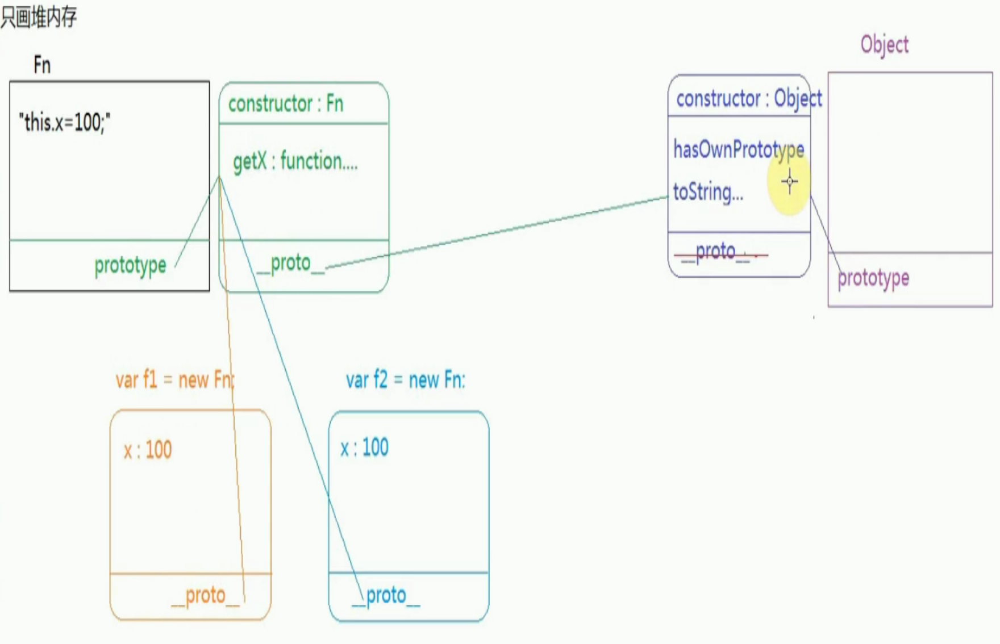

# 原型链
首先我们讲下三个概念

1. 每一个函数数据类型（普通函数，类）都有一个天生自带的属性：prototype（原型），并且这个属性是一个对象数据类型的值
2. 并且在prototype上浏览器天生给它加了一个属性constructor（构造函数），属性值是当前函数（类）本身
3. 每一个对象数据类型(普通得对象，实例，prototype。。。)也天生自带一个属性：proto，属性值是当前实例所属类的原型

类是函数数据类型，如Object，Array

```
function Fn(){
    this.x = 100;
}
Fn.prototype.getX = function(){
    console.log(this.x);
}
var f1 = new Fn;
var f2 = new Fn;

console.log(Fn.prototype.constructor === Fn);// true
```
以上代码说了一个函数数据类型Fn，它有一个私有属性x，有一个公有属性getX（公有属性即在原型上的属性），然后构建了两个实例f1和f2。

我们判断Fn.prototype.constructor即为当前函数（类）本身。5



```
f1 instanceof Object // true
```
因为f1通过__proto__可以向上级查找，不管有多少级，总能找到Object

在Object.prototyoe上没有__proto__这个属性 Object是所有数据类型的基类，最顶层的类

原型链模式
```
f1.hasOwnProperty('x') //true
// 说明hasOwnPrototype是f1的一个属性
// 但f1没有hasOwnPrototype这个方法
```
1. 通过 对象名.属性名的方式获取属性值的时候，首先在对象的私有属性上查找，如果私有中存在这个属性，则获取的是私有的属性值；

2. 如果私有的没有，则通过__proto__找到所属类的原型（类的原型上定义的属性和方法都是当前实例公有的属性和方法）；

3. 原型上存在的话，获取的是公有的属性值；

4. 如果原型上也没有，则继续通过原型上的__proto__继续向上查找，一直找到Object.prototype为止...没有则为undefined,这就是原型链。

下面说几道题，还是上面那段代码
```
f1.getX === f1.getX; //true

f1.__proto__.getX === f2.getX; //true

f1.getX === Fn.prototype.getX; //true
```

在`ie`浏览器中，我们的原型是同样的原理。但因为ie浏览器怕通过`__proto__`把共有的属性修改，禁止使用`__proto__`，所以在`ie`下没有这个属性。